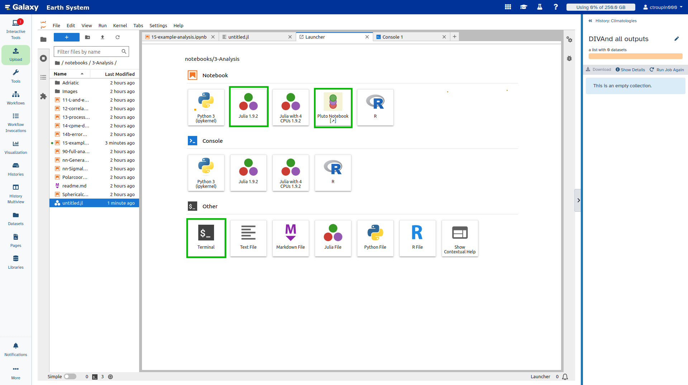
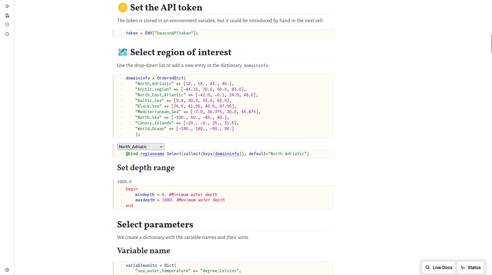
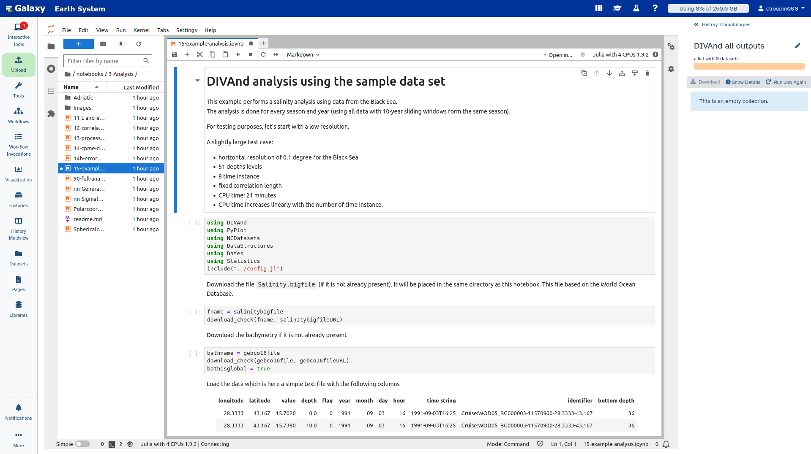

# Tool description

DIVAnd stands for Data-Interpolating Variational Analysis in n dimensions. 

It performs an n-dimensional variational analysis/gridding of arbitrarily located observations.

:::{note}
While DIVAnd has been mostly used on oceanographic data, interpolation can be performed on any type of geo-referenced observations.
:::

## Installation

The source code (in [Julia](https://julialang.org/)) is available from GitHub: https://github.com/gher-uliege/DIVAnd.jl.

The package is installed in Julia with the command:
```julia
import Pkg
Pkg.add("DIVAnd")
```

## Deployment

For the deployment on servers, different options are available:
1. From source (installing Julia and the related packages).
2. Using a Docker image: https://github.com/gher-uliege/DIVAnd-jupyterhub
3. Using a Singularity container: https://github.com/gher-uliege/DIVAnd-singularity

The second solution is the most used for the deployment in _Virtual Research Environments_.

## Reference

Barth, A., Beckers, J.-M., Troupin, C., Alvera-Azcárate, A., and Vandenbulcke, L. (2014): DIVAnd-1.0: n-dimensional variational data analysis for ocean observations, Geosci. Model Dev., 7, 225-241, doi:10.5194/gmd-7-225-2014

# Using DIVAnd

There are several ways to use `DIVAnd`:
1. From the Julia terminal.
2. Using [Jupyter](https://jupyter.org/) notebooks.
3. Using [Pluto](https://plutojl.org/) notebooks.

While Jupyter notebooks are widely adopted and allow users to work with different programming languages, `Pluto` is more recent and only works with Julia. They offer more interactivity than traditional notebooks, while ensuring a full reproducibility by storing all the package versions withing the notebook file.

# Using DIVAnd in FAIR-EASE

In FAIR-EASE, `DIVAnd` has been deployed using the Docker container.

## Galaxy

Galaxy offers different possibilities to work with `DIVAnd`.     
The session in Galaxy can be started at https://earth-system.usegalaxy.eu/.




### Terminal

This solution is especially relevant for advanced users, who already have their code written in a script and don't need a sophisticated interface.

### Pluto

The Pluto notebooks provide more interactivity, yet they take some time to start due to the package compilation. 



### Jupyter

This is the most used solution. Users have access to a set of notebooks designed to explain how to use `DIVAnd`. The notebooks are also available from GitHub: https://github.com/gher-uliege/Diva-Workshops.




## D4Science

D4Science also 


The session in Galaxy can be started at 
https://fair-ease.d4science.org/

