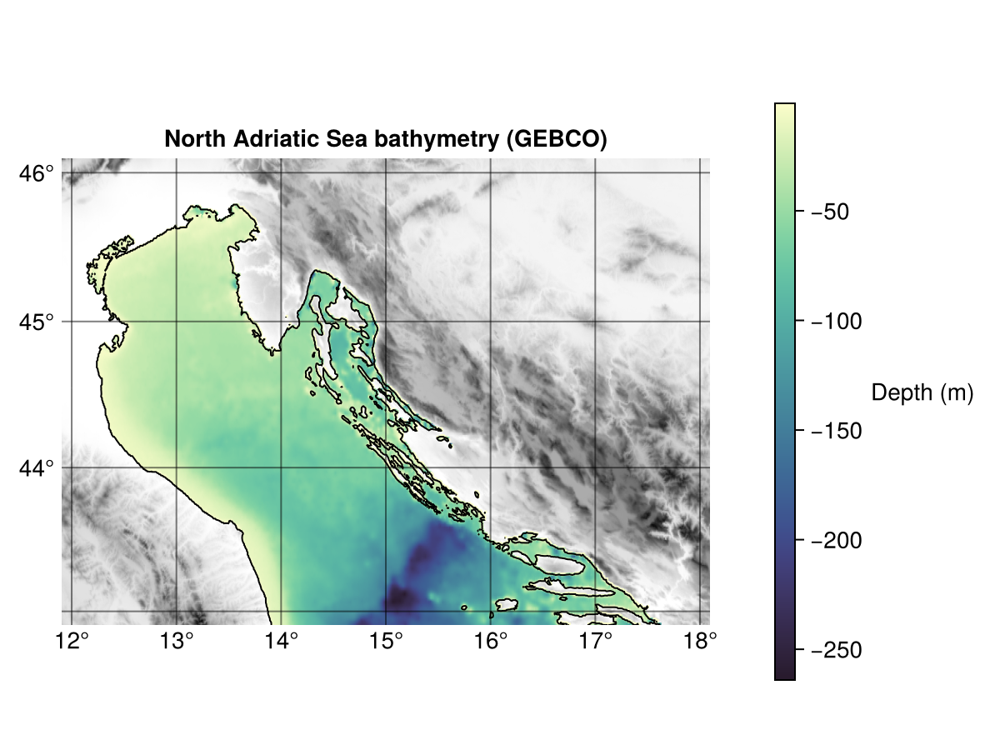

# Coastal water dynamics book

The _Coastal Water Dynamics_ pilot is a component of the _Earth & Environmental Dynamics_ use case.
It strives to study specific processes taking place near river estuaries, for instance:
- evolution of plankton blooms 
- transport and fate of nutrients, carbon, and contaminants 
- mixing between fresh and salty water at the edges of the river plumes.

All these process depend critically on many factors, including river discharge, ocean circulation, meteorological conditions and biogeochemical processes in the water column. 

## Region of interest

The pilot focuses on the northern Adriatic Sea, with a specific focus on the region where the Po river discharges into the sea.

## Tools

Three main tools, described in details in the next sections, are exploited for this use case:
- [ODV](https://odv.awi.de) (ODV) and its web-based version (webODV) for the analysis and visualisation of data;
- [SOURCE](https://github.com/fair-ease/Source) for the reprocessing, calibration and evaluation of models and climatologies;
- [DIVAnd](https://github.com/gher-uliege/DIVAnd.jl) for the gridding of in situ measurements.
